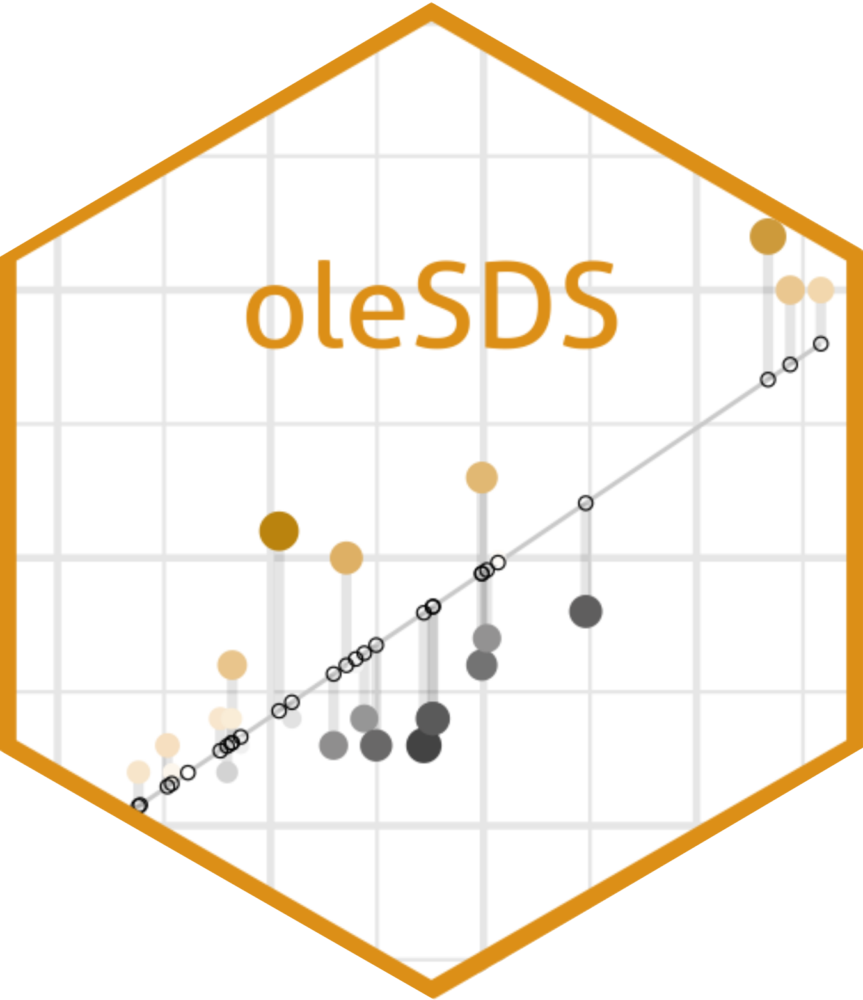

  

# Welcome to the Stats and Data Science R Workshop!

We're so glad you have a desire to learn R! You are well on your way to adding a powerful tool to your data analysis skill set. On this page you will find helpful information and additional resources to those presented this week. Remember, all of the code and examples used in the workshop can be found directly on the [St. Olaf RStudio server](https://r.stolaf.edu/) in the `Workshop 101 summer21` folder.

> Enjoy your R experience!!

## Workshop Schedule

- **Tuesday 6/1**

- **Wednesday 6/2**

- **Thursday 6/3**

- **Friday 6/4**

## Accessing Materials

You will eventually lose access to our workshop folder on the R server.  If you want to hold on to the materials and your code from this workshop, we recommend **Exporting zipped folders of your material to your laptop** (check a folder to export, and then go to More > Export). We will remind you again on Friday to do this, after you’ve had a chance to write code for all of our activities.

## Questions

R has a learning curve and nobody becomes an expert without making mistakes. Please feel free to ask us your questions at any point during the workshop. Since many errors and issues with R are specific to an individual user please use the following Google doc link to send us your questions. We will monitor the document and provide answers right away. If it’s a really good one, we’ll even bring it up in the main room.

> [**Link to Google doc for Questions**](https://docs.google.com/document/d/1Mbq-ehvx_DpYUIYlBFUxSLbUxS9s3Di6yYxXVGHy_nM/edit?usp=sharing)

You may also send a direct message in Zoom to one of the TAs if you’d like one on one help.

## R Cheatsheets

1. [RStudio Environment Guide](https://github.com/rstudio/cheatsheets/raw/master/rstudio-ide.pdf)
2. [R Markdown Reference](https://www.rstudio.com/wp-content/uploads/2015/03/rmarkdown-reference.pdf)
3. [R Markdown Cheat Sheet](https://github.com/rstudio/cheatsheets/raw/master/rmarkdown-2.0.pdf)
4. [Basic R Code](http://github.com/rstudio/cheatsheets/raw/master/base-r.pdf)
5. [Data Import](https://github.com/rstudio/cheatsheets/raw/master/data-import.pdf)
6. [Data Wrangling](https://github.com/rstudio/cheatsheets/raw/master/data-transformation.pdf)
7. [Data Visualization using ggplot2](https://github.com/rstudio/cheatsheets/raw/master/data-visualization-2.1.pdf)
8. [More Cheatsheets](https://www.rstudio.com/resources/cheatsheets/)

## Additional R learning resources

- [learnR4free](https://www.learnr4free.com/advanced.html)

## Using R outside of the St. Olaf server

- [Download R](https://www.r-project.org/)

- [Download RStudio](https://www.rstudio.com/)

- [Use the Cloud (no download required)](https://rstudio.cloud/)
