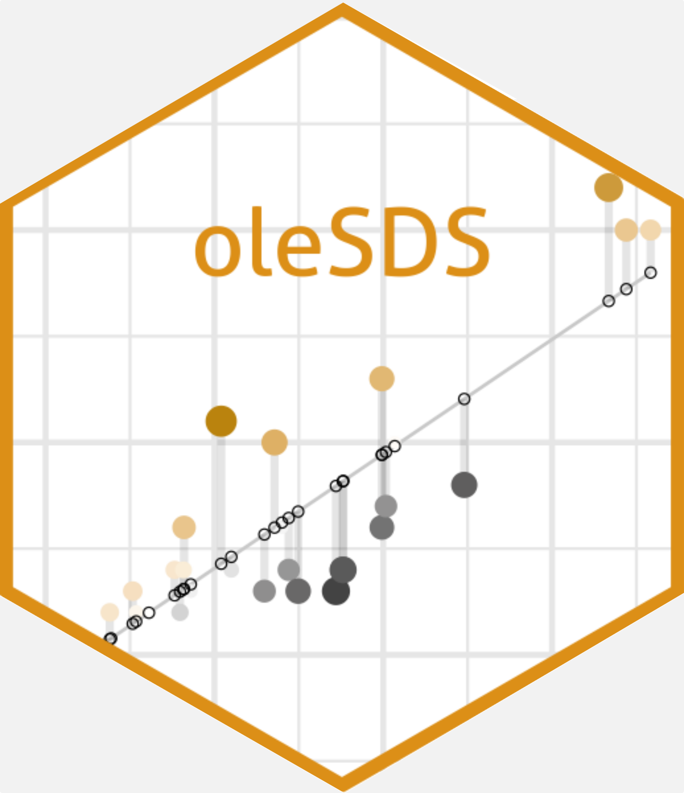

  

# Welcome to the Stats and Data Science R Workshop!

We're so glad you have a desire to learn R! You are well on your way to adding a powerful tool to your data analysis skill set. On this page you will find helpful information and additional resources to those presented this week. Remember, all of the code and examples used in the workshop can be found directly on the [St. Olaf RStudio server](https://r.stolaf.edu/) in the `Workshop 101 summer21` folder.

> Enjoy your R experience!!

## Workshop Schedule

- **Tuesday June 1 (1-4 PM)** with Sharon Lane-Getaz and Joe Roith
    - Welcome
    - Intro to RStudio and the `tidyverse`
    - Data viz and exploratory data analysis with `ggplot2`

- **Wednesday June 2 (1-4 PM)** with Laura Boehm Vock and Jaime Davila
    - Data wrangling
    - Data transformation

- **Thursday June 3 (1-4 PM)** with Matt Richey and Paul Roback
    - Modeling with regression
    - Predictive modeling

- **Friday June 4 (9 AM - 12 PM)** choose your own adventure
    - 9-10 *Room 1*: Review/extension of Day 1
    - 9-10 *Room 2*: Review/extension of Day 2
    - 9-10 *Room 3*: Review/extension of Day 3
    - 10-11: same 3 rooms, participants may move around
    - 11-12: Breakout rooms with reflection discussions and final questions

## Questions

R has a learning curve and nobody becomes an expert without making mistakes. Please feel free to ask us your questions at any point during the workshop. Since many errors and issues with R are specific to an individual user please use the following Google doc link to send us your questions. We will monitor the document and provide answers right away. If it’s a really good one, we’ll even bring it up in the main room.

#### [**Link to Google doc for Questions**](https://docs.google.com/document/d/1Mbq-ehvx_DpYUIYlBFUxSLbUxS9s3Di6yYxXVGHy_nM/edit?usp=sharing)

You may also send a direct message in Zoom to one of the TAs if you’d like one on one help.

## Accessing Materials

You will eventually lose access to our workshop folder on the R server.  If you want to hold on to the materials and your code from this workshop, we recommend **Exporting zipped folders of your material to your laptop** (check a folder to export, and then go to More > Export). We will remind you again on Friday to do this, after you’ve had a chance to write code for all of our activities.

## R Cheatsheets

1. [RStudio Environment Guide](https://github.com/rstudio/cheatsheets/raw/master/rstudio-ide.pdf)
2. [R Markdown Reference](https://www.rstudio.com/wp-content/uploads/2015/03/rmarkdown-reference.pdf)
3. [R Markdown Cheat Sheet](https://github.com/rstudio/cheatsheets/raw/master/rmarkdown-2.0.pdf)
4. [Basic R Code](http://github.com/rstudio/cheatsheets/raw/master/base-r.pdf)
5. [Data Import](https://github.com/rstudio/cheatsheets/raw/master/data-import.pdf)
6. [Data Wrangling](https://github.com/rstudio/cheatsheets/raw/master/data-transformation.pdf)
7. [Data Visualization using ggplot2](https://github.com/rstudio/cheatsheets/raw/master/data-visualization-2.1.pdf)
8. [More Cheatsheets](https://www.rstudio.com/resources/cheatsheets/)

## Additional R learning resources
There are tons of resources out there to learn R on your own and it can be a little overwhelming. If you would like to dive deeper into R, or find help with more specific types of data analysis, these resources may help.

- **Online**
    - [A gentle introduction to tidy statistics](https://www.rstudio.com/resources/webinars/a-gentle-introduction-to-tidy-statistics-in-r/) (*webinar - 54 min*)
    - [learnR4free](https://www.learnr4free.com/advanced.html)
    - [RStudio primers](https://rstudio.cloud/learn/primers)
    - [Swirl](http://swirlstats.com/) (more traditional R in the RStudio environment)
    - [More resources for intermediate R users](https://education.rstudio.com/learn/intermediate/)

- **Free (or cheap) textbooks**
    - [*R for Data Science*](https://r4ds.had.co.nz/) by Hadley Wickham and Garrett Grolemund
    - [*A Modern Dive into R and the Tidyverse*](https://moderndive.com/) by Chester Ismay and Albert Y. Kim
    - [*Hands-On Programming with R*](https://rstudio-education.github.io/hopr/) by Garrett Grolemund
    - [*Data Visualization: A Practical Introduction*](https://kieranhealy.org/publications/dataviz/) by Kieran Healy
    - [*ggplot2: Elegant Graphics for Data Analysis*](https://www.amazon.com/dp/0387981403/) by Hadley Wickham

- **Stuck in R?** Someone out there probably has a solution, try finding it![^1]
    - Search the help documentation for a particular function directly in RStudio
    - [Google it](https://www.google.com/) (*Pro tip:* we do it every time we code!)
    - [RStudio Community](https://community.rstudio.com/)
    - [Stack Overflow](https://stackoverflow.com/questions/tagged/r)

[^1]: Understanding documentation and code written by others is an acquired skill that takes practice. Just try it out and remember, you can't break R!
    

## Using R outside of the St. Olaf server
Want to continue using R offline? Moved on from St. Olaf and no longer have access to the server? You can download and run R locally for all of your projects. Just remember, you need both R (the engine) and RStudio (the steering wheel, dashboard, and pedals). While you may never actually open R, it's important to keep it installed and up to date. You will also need to set up your library, so don't forget to install and load those packages.

- [Download R](https://www.r-project.org/)
- [Download RStudio](https://www.rstudio.com/)
- [Use the RStudio Cloud (no download required)](https://rstudio.cloud/)

## Acknowledgements

A special thanks to our student TAs, Julia Cordes, Raymond Fleming, and Tim Roback!

---
